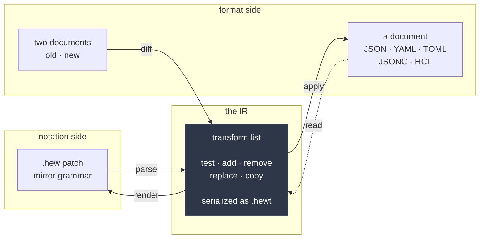

hew is four components arranged around a single internal representation. The IR is the
**transform list**: a flat, ordered sequence of primitive operations, with a canonical
serialization (`.hewt`) that is itself an accepted input.

**parse** and **render** are notation-side inverses: `.hew` text in, transform list out,
and back. **diff** and **apply** are format-side inverses: two documents in, transform
list out; transform list plus a document in, a document out. Neither pair knows anything
about the other's world. The parser has never seen a YAML file; the applier has never
seen a margin character.

## Why the boundary is where it is

Three separate needs land on the same seam, which is the sign it is the right one.

**Conformance needs it.** [The corpus](/hew/standard/) pins each of these arrows as its own
*seam*, and a runner must exercise each separately. An end-to-end-only corpus cannot tell
a parser bug from an applier bug, and in a project with two implementations those are
written by different people in different languages. A Rust port passes every `parse` case
before it has a single format binding.

**Interop needs it.** The transform list resolves to an RFC 6901 op list against a
concrete document, which is what `hew apply --ops` prints. That is the interop surface: a
tool that speaks RFC 6902 can consume hew's intent without learning hew's notation.

**Honesty needs it.** One human-authoring notation cannot express everything, and hew has
exactly one. Node moves and copies are the gap — shape-mirroring has no way to write
"this node, but over there". Rather than bolt a second grammar on, hew accepts the IR as
an input: `hew apply --transforms move.hewt`. The escape hatch costs no new surface,
because the IR had to be specified for the corpus and for interop regardless.
[See it in use →](/hew/examples/move-escape-hatch/)

## Five primitives

The operations catalog behind the spec surveys 52 operations from the prior art — RFC
6902, RFC 5261, RFC 7386, go-patch, jd, Kubernetes strategic merge, spruce, Coccinelle's
SmPL, and eight config-editing mechanisms from ctxloom itself. They reduce to five:

| Primitive | Does |
|---|---|
| `test` | Assert a node's value. Nothing else; it never writes. |
| `add` | Insert a node, optionally positioned relative to a sibling. |
| `remove` | Delete a node. |
| `replace` | Change a node's value. |
| `copy` | Duplicate a subtree, source bytes and attached comments included. |

Everything richer is either sugar the parser compiles away or an explicit omission with a
recorded reason. `move` is accepted on input and normalized to `copy` + `remove`. Rename
is a move within a mapping. The IR is essentially assembly, and that is deliberate: a
small primitive set is what a second implementation can be held to.

## Where the tolerance lives

Note which component the tolerance is *not* in. Context lines compile into `test`
transforms at parse time, so a stale target fails inside the IR rather than because an
applier chose to be careful. An applier that skipped its `test` transforms would not be a
lenient hew — it would fail the corpus. The property the format exists to provide is
structural, not behavioural.

## The implementations

The Go library and `hew` CLI are the first implementation; a Rust port is planned and
will run the same corpus. That is what makes it a port rather than a rewrite: the
standard is not "whatever Go does", it is a directory of fixtures both must satisfy.
